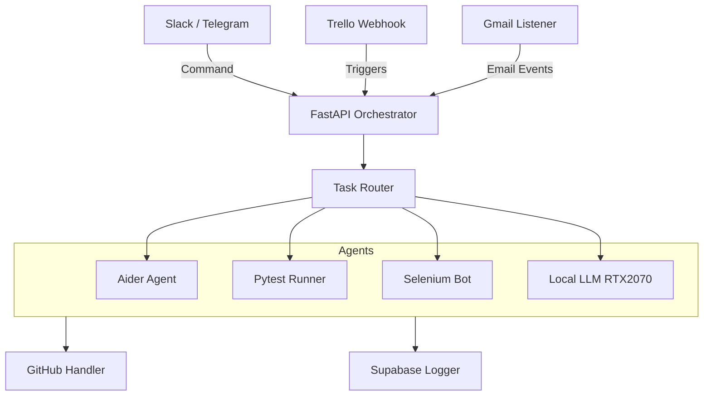
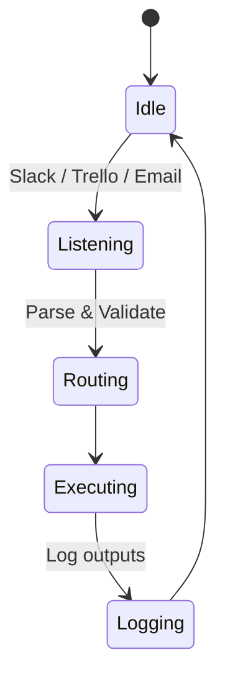
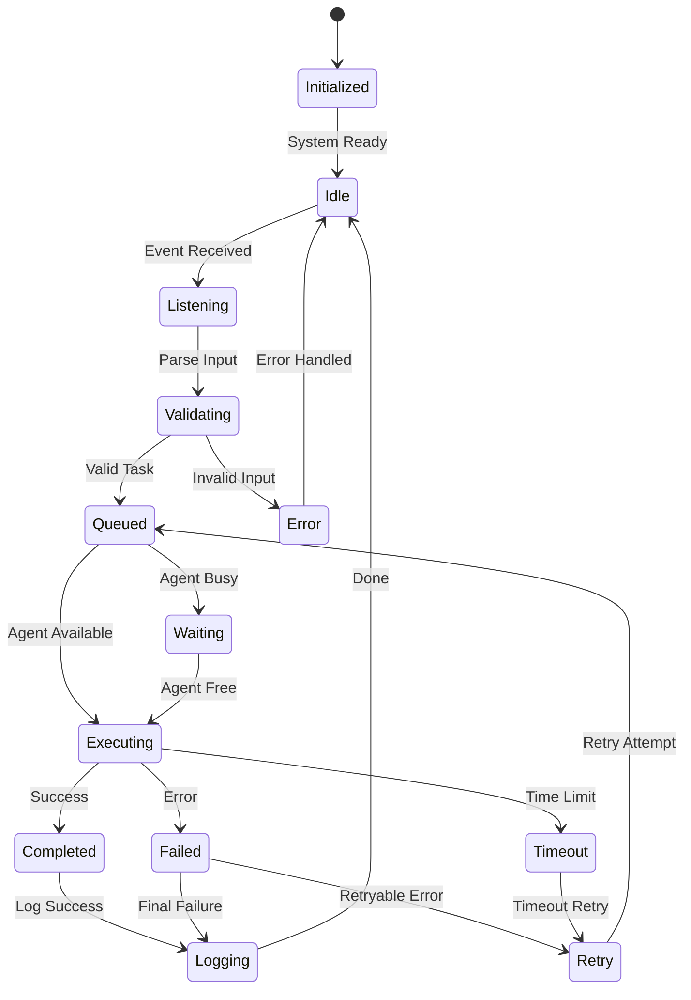
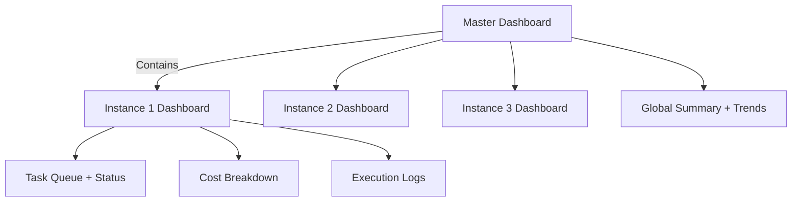

# Jace Berelen: AI-Driven Workflow Automation Platform
## Complete Specification & Implementation Guide

---

# Executive Summary

Jace Berelen is a generalist AI-powered orchestrator designed for full-lifecycle task automation across software development, analytics, QA, design, research, documentation, and operations. Originally created to enable overemployment support for high-skill professionals, it's architected to scale into a commercial SaaS product.

## Key Value Propositions
- **Manage 5-10 jobs simultaneously** with isolated AI agents
- **Minimal AI costs** through local model preference
- **Enterprise-grade security** with containerized execution
- **Airgap-safe delivery** for sensitive client environments
- **Complete observability** with task-level audit trails

---

# 1. Vision & Strategic Goals

## 1.1 Core Vision
To build a secure, extensible, and intelligent platform that helps professionals automate parallel work streams, deliver high-quality results, and eventually scale into a commercial SaaS product.

## 1.2 Operating Principles
- **Minimal AI costs** (local model preference)
- **Maximum observability** (task-level audit, dashboards)
- **Total compartmentalization** (scoped containers, AI task limitations)
- **Multimodal interfaces** (Slack, Telegram, Email, Trello, Dashboards)
- **Task diversity**: code, QA, research, writing, design, documentation

## 1.3 Strategic Recommendations
**Immediate Focus:**
- Define clear success metrics for each principle (cost targets, observability KPIs, security benchmarks)
- Add "Progressive Enhancement" approach: system works with minimal features, gradually adds complexity
- Establish "Time-to-Value" goal: users see value within 15 minutes of setup

**Risk Mitigation:**
- Plan for "Graceful Degradation" when AI services are unavailable
- Build in compliance considerations early (GDPR, SOC2) for enterprise clients

---

# 2. Architecture Overview

## 2.1 System Architecture



## 2.2 Core Components

### Input Layer
- **Slack/Telegram Bots**: Command interface and notifications
- **Trello Webhooks**: Card-based task triggering
- **Gmail Listener**: Email-based task initiation

### Processing Layer
- **FastAPI Orchestrator**: Central coordination hub
- **Task Router**: Intelligent task distribution
- **Agent Pool**: Specialized AI and automation agents

### Output Layer
- **GitHub Handler**: Code repository management
- **Supabase Logger**: Comprehensive audit trails
- **Delivery Bundler**: Airgap-safe package creation

## 2.3 Architecture Enhancements Needed

**Missing Critical Components:**
- **Message Queue** (Redis/RabbitMQ) between API and Task Router for reliability
- **Load Balancer** for multiple FastAPI instances
- **Health Check Service** to monitor all components
- **Secret Manager** integration (AWS Secrets Manager/HashiCorp Vault)

**Scalability Improvements:**
- **Agent Pool Manager** for dynamic Docker container scaling
- **Circuit Breaker** pattern for external service failures
- **Rate Limiter** at API level to prevent abuse

**Advanced Patterns:**
- **Event Sourcing** for task history and replay capability
- **CQRS** (Command Query Responsibility Segregation) for read/write separation
- **Microservices** approach: separate services for each agent type

---

# 3. Implementation Roadmap

## 3.1 Maturity Stages Overview

| Stage | Description | Timeline | Key Deliverables |
|-------|-------------|----------|------------------|
| **Stage 0** | Proof-of-Concept | Today | Slack bot, Aider integration, basic commands |
| **Stage 1** | Overemployment Support | Month 1-2 | 5 jobs, delivery bundles, isolation |
| **Stage 2** | Scale to 10 Projects | Month 3-6 | Containerization, dashboards, automation |
| **Stage 3** | SaaS Product | Month 6-12 | Multi-tenancy, billing, enterprise features |

## 3.2 Stage 0: Proof of Concept (START HERE)

### Week-by-Week Implementation Plan

**Week 1: Foundation**
- [ ] Set up development environment with proper tooling
- [ ] Create basic FastAPI app with health check endpoint
- [ ] Implement simple in-memory task queue
- [ ] Build basic Slack bot with `/jace help` command

**Week 2: Core Integration**
- [ ] Add Aider integration with error handling
- [ ] Implement basic logging (file-based initially)
- [ ] Create simple task status tracking
- [ ] Add `/jace aider` command with basic functionality

**Week 3: Testing & Validation**
- [ ] Add comprehensive error handling and retries
- [ ] Implement basic security measures
- [ ] Create simple monitoring/alerting
- [ ] Add `/jace test` command functionality

**Week 4: Polish & Deploy**
- [ ] Add proper configuration management
- [ ] Implement graceful shutdown and restart
- [ ] Create deployment scripts
- [ ] Conduct user acceptance testing

### Success Criteria for Stage 0
- ✅ Bot responds to commands within 5 seconds
- ✅ At least 90% command success rate
- ✅ Proper error messages for failures
- ✅ Basic logging and monitoring in place

### Minimal Setup Checklist
1. [ ] Install Aider locally + set OPENAI key in `.env`
2. [ ] Create Slack bot + webhook routes
3. [ ] Connect to Trello webhook + Supabase DB
4. [ ] Test basic `/jace` commands

## 3.3 Stage 1: Overemployment Support (5 Jobs)

### Key Features
- Gmail + Trello + Slack unification
- Scheduled summaries and status updates
- Markdown delivery bundles
- Per-project memory and isolation
- Slack daily digest with updates from Trello/GitHub per job

### Risk Mitigation Strategies
**Multi-Job Management Risks:**
- **Context switching overhead**: Implement comprehensive job context storage
- **Secret management complexity**: Use dedicated secret management service
- **Cross-job contamination**: Strict isolation with validation checks
- **Time tracking accuracy**: Automated time logging with manual verification

**Client Relationship Risks:**
- **Communication mix-ups**: Clear channel naming and message threading
- **Quality consistency**: Standardized output templates and review processes
- **Response time expectations**: SLA definition and automated status updates
- **Billing disputes**: Detailed activity logs and transparent reporting

## 3.4 Stage 2: Scale to 10 Projects

### Technical Scaling Requirements
- **Infrastructure auto-scaling** based on demand
- **Database optimization** for 10x data growth
- **Monitoring system upgrades** for increased complexity
- **Security hardening** for larger attack surface

### Operational Scaling
- **Incident response procedures** for complex multi-tenant issues
- **Customer support processes** for handling multiple clients
- **Quality assurance scaling** with automated testing and reviews
- **Performance optimization** for resource efficiency

## 3.5 Stage 3: SaaS Product

### Product-Market Fit Validation
**Market Research:**
- **Competitive analysis** of existing automation tools
- **Customer interviews** with potential enterprise clients
- **Pricing research** and willingness-to-pay studies
- **Feature prioritization** based on customer feedback

**Business Model Validation:**
- **Unit economics analysis** (LTV vs CAC)
- **Pricing experiments** with different tiers
- **Churn analysis** and retention optimization
- **Revenue forecasting** and growth projections

---

# 4. Technical Specifications

## 4.1 Technology Stack

### Core System (Production-Ready)
- **Python 3.11+** - Primary language
- **FastAPI** - Task API, webhook listener
- **Celery** - Task queue, retries, chaining
- **Docker** - Containerized agent isolation
- **Supabase** - PostgreSQL + pgvector
- **Railway** - Prototype hosting
- **Terraform + AWS CLI** - Production IaC

### AI Tooling Stack
- **Aider** - OpenAI-powered dev agent
- **Continue.dev** - IDE-injected workflows
- **Local LLMs**: LLaMA, DeepSeek, Mixtral (via `llama.cpp`)
- **GPT-4 / Claude / Gemini** - Fallback API models

### Integration Layer
- **PyGitHub, GitPython** - PR/clone actions
- **python-slack-sdk & python-telegram-bot** - Communication
- **Selenium & Playwright** - Web automation
- **Trello SDK + Gmail API** - Task triggers
- **Pytest & Coverage.py** - Automated QA

### Dashboard & Monitoring
- **Streamlit** - 3 instance dashboards + 1 master
- **Plotly + Supabase** - Real-time visual reporting

## 4.2 Technology Stack Improvements

### Core System Enhancements
- **Add Redis** for caching and session management
- **Replace Celery with Temporal** for better workflow orchestration and debugging
- **Add nginx** as reverse proxy for production
- **Include Pydantic** for data validation and API documentation

### AI Tooling Optimizations
- **Ollama** instead of raw llama.cpp for easier model management
- **LangChain/LlamaIndex** for better prompt engineering and retrieval
- **Anthropic's Computer Use** for GUI automation (when available)
- **OpenAI Assistants API** for persistent conversations

### Monitoring & Observability
- **Prometheus + Grafana** for metrics
- **Sentry** for error tracking
- **Jaeger** for distributed tracing
- **ELK Stack** (Elasticsearch, Logstash, Kibana) for log analysis

### Security Additions
- **OAuth 2.0/JWT** for authentication
- **HashiCorp Vault** for secret management
- **Let's Encrypt** for SSL certificates
- **fail2ban** for brute force protection

## 4.3 Core Features Implementation

### Feature Priority Matrix

**Tier 1 (Must Have - Build First):**
- Slack bot with 3 essential commands: `/jace help`, `/jace status`, `/jace aider`
- Basic logging to file (before Supabase)
- Simple task queuing (even in-memory to start)

**Tier 2 (Should Have - Build Second):**
- GitHub integration (read-only first)
- Container isolation
- Basic dashboard

**Tier 3 (Nice to Have - Build Later):**
- Telegram integration
- Advanced AI routing
- Delivery bundles

### Implementation Strategy
- **Start with synchronous execution** before adding async complexity
- **Build CLI version first** before web interfaces (easier to test)
- **Mock external services** initially (GitHub, Trello) for faster development
- **Version your APIs** from day 1 (`/api/v1/`) for future compatibility

---

# 5. Security Framework

## 5.1 Security Design Principles

### Basic Security (Stage 0)
- AI models never access `.env`, secrets, or full repo unless required
- All AI tasks run in secure Docker containers with scoped volumes
- The orchestrator signs off on all deploy-level actions
- GitHub PRs require Slack approval before merging
- Production systems can run 100% airgapped (manual bundle delivery)

### Enhanced Security Framework (Stage 1+)

**Zero Trust Architecture:**
- Assume every component is compromised
- Implement mutual TLS between all services
- Use short-lived tokens (15-minute max)
- Log every access attempt

**Container Security:**
- Use **non-root users** in all containers
- Implement **seccomp** and **AppArmor** profiles
- Run containers with **read-only filesystems**
- Use **distroless** base images

**Data Protection:**
- Encrypt all data at rest and in transit
- Implement **data retention policies** (auto-delete after 90 days)
- Use **field-level encryption** for sensitive data in database
- Add **PII detection** to prevent accidental exposure

## 5.2 Secrets Management Best Practices
- Rotate all secrets every 30 days
- Use different secrets per environment
- Implement **secret scanning** in CI/CD
- Never log secrets or sensitive data

---

# 6. Cost Optimization Strategy

## 6.1 Cost Calculation Model

### Basic Formula
```
C = (U_api × R_api) + (U_llm × R_llm) + (H_gpu × R_gpu) + M_supabase
```

Where:
- U_api = number of external API calls (e.g., GPT-4)
- R_api = cost per API call
- U_llm = number of local LLM calls
- R_llm = cost per local execution (≈ energy use)
- H_gpu = GPU usage in hours
- R_gpu = hourly cost for local GPU (amortized)
- M_supabase = Supabase monthly subscription

### Example Calculation
```
C = (1500 × 0.003) + (3000 × 0.0005) + (120 × 0.02) + 25 = $33.40
```

## 6.2 Enhanced Cost Model
```
C = Infrastructure + AI_Usage + Third_Party + Labor + Opportunity_Cost

Where:
Infrastructure = (Server + Storage + Network + Monitoring)
AI_Usage = (External_API + Local_Compute + GPU_Hours)
Third_Party = (Supabase + GitHub + Slack + Monitoring_Tools)
Labor = (Development + Maintenance + Support)
Opportunity_Cost = (Revenue_Lost_from_System_Downtime)
```

## 6.3 Cost Optimization Tactics

### AI Cost Reduction
- **Prompt caching** for repeated queries
- **Model quantization** for local LLMs (4-bit/8-bit)
- **Request batching** for API calls
- **Smart model routing** (easy tasks → cheap models)
- **Context compression** to reduce token usage

### Infrastructure Optimization
- **Spot instances** for non-critical workloads
- **Auto-scaling** based on task queue length
- **Resource pooling** across multiple jobs
- **Efficient container scheduling**

### Budget Management
- Set **hard limits** per client/project
- Implement **cost alerts** before budget exhaustion
- Create **cost allocation** reports per client
- **Emergency shutdown** procedures for runaway costs

---

# 7. Workflow & Task Management

## 7.1 Workflow Routing Logic

### Current State Machine


### Enhanced State Machine (Recommended)


## 7.2 Task Trigger Examples

### Basic Triggers (Stage 0)
- `/jace aider edit app.py` → starts background agent
- `/jace test https://github.com/user/repo` → clones, runs pytest, posts result
- `/jace scrape https://example.com` → uses Selenium, returns text or screenshot

### Advanced Triggers (Stage 1+)
- Trello card tagged `auto-design` → invokes `ui_drafter` agent
- GitHub PR created by client → summary + test results posted back
- Email with `subject: PROD DOWN` → escalation to Telegram + summary

### Smart Trigger Processing
- **Priority detection** from natural language ("urgent", "ASAP", "when you have time")
- **Context extraction** from surrounding messages or card descriptions
- **Dependency resolution** (don't start Task B until Task A completes)
- **Resource availability** checking before trigger activation

## 7.3 Task Categorization by Complexity

**Level 1 - Basic Automation (High Success Rate):**
- File organization and cleanup
- Simple data transformations (CSV → JSON)
- Basic text processing and formatting
- Standard report generation
- Simple API data fetching

**Level 2 - Intermediate Intelligence (Medium Success Rate):**
- Code review and suggestions
- Documentation generation from code
- Test case generation
- Basic design recommendations
- Data analysis with insights

**Level 3 - Advanced AI Tasks (Requires Human Review):**
- Architecture recommendations
- Complex business logic generation
- Creative content creation
- Strategic decision support
- Custom algorithm development

---

# 8. Multi-Workspace Isolation

## 8.1 Isolation Requirements
Each job/project must be managed in complete isolation:
- Separate Trello board
- Separate vector store (or namespace)
- Separate agent config (model, memory, timeout)
- Each Slack channel treated as unique "workspace"

## 8.2 Technical Isolation Architecture

### Container-Level Isolation
- **Dedicated resources** per workspace
- **Network segmentation** to prevent cross-workspace communication
- **Filesystem isolation** with encrypted workspace-specific volumes
- **Process isolation** with dedicated user accounts per workspace

### Data Isolation
- **Database schema separation** or tenant-specific databases
- **Encryption key management** unique per workspace
- **Audit log separation** with workspace-specific retention policies
- **Backup isolation** with independent restore capabilities

### Resource Management
- **Resource quotas** per workspace (CPU, memory, storage, AI tokens)
- **Fair scheduling** to prevent one workspace from monopolizing resources
- **Burst capacity** allocation for urgent tasks
- **Cost allocation** and billing per workspace

---

# 9. Monitoring & Dashboards

## 9.1 Dashboard Architecture

### Streamlit Dashboard Layout


### Dashboard Types

**Executive Dashboard:**
- **KPI summary cards** (uptime, cost efficiency, client satisfaction)
- **Revenue impact** calculations
- **Client activity heatmaps**
- **Strategic recommendations** based on usage patterns

**Operational Dashboard:**
- **System health indicators** (green/yellow/red status)
- **Resource utilization graphs** (CPU, memory, disk, GPU)
- **Error rate trending** with drill-down capabilities
- **Performance optimization suggestions**

**Client Dashboard:**
- **Task completion status** for each client
- **Billing and usage reports**
- **Quality metrics** (success rates, revision requests)
- **Client-specific insights** and recommendations

## 9.2 Alert System
- **Multi-channel alerts** (Slack, email, SMS)
- **Smart alerting** (reduce noise, escalate appropriately)
- **Custom alert rules** per client or task type
- **Alert fatigue prevention** with intelligent grouping

---

# 10. Business Strategy & Monetization

## 10.1 Pricing Tiers

### Starter Tier ($29/month)
- 100 AI-powered tasks per month
- Basic Slack integration
- 2 connected workspaces
- Email support

### Professional Tier ($99/month)
- 500 AI-powered tasks per month
- Full platform access (Slack, Trello, GitHub)
- 10 connected workspaces
- Priority support + live chat

### Enterprise Tier ($299/month)
- Unlimited AI-powered tasks
- Custom integrations and workflows
- Unlimited workspaces
- Dedicated account manager
- SLA guarantees

### Enterprise Plus (Custom pricing)
- On-premises deployment
- Custom AI model training
- White-label solutions
- Professional services

## 10.2 Revenue Optimization Strategies

### Value-Added Services
**Professional Services:**
- **Implementation consulting** ($150/hour)
- **Custom workflow development** ($200/hour)
- **Training and onboarding** ($100/hour per participant)
- **Integration development** (project-based pricing)

**Premium Features:**
- **Advanced analytics and reporting** (+$20/month)
- **Multi-region deployment** (+$50/month)
- **Enhanced security features** (+$30/month)
- **Priority model access** (+$40/month)

### Partnership Revenue
- **Referral programs** with automation consultants
- **Integration partnerships** with tool vendors
- **White-label licensing** to larger organizations
- **Data insights** (anonymized) to market research firms

---

# 11. Infrastructure Strategy

## 11.1 Multi-Environment Strategy
- **Development**: Local Docker Compose + local databases
- **Staging**: Railway/Vercel for rapid iteration
- **Production**: AWS with full redundancy
- **DR (Disaster Recovery)**: Multi-region AWS deployment

## 11.2 Cloud-Native Architecture
- **Kubernetes** (EKS) for container orchestration
- **Service mesh** (Istio) for secure service communication
- **Auto-scaling** based on demand and resource utilization
- **Spot instances** for cost optimization on non-critical workloads

## 11.3 Database Strategy
- **Primary**: RDS PostgreSQL with read replicas
- **Caching**: Redis cluster for session and query caching
- **Vector DB**: Pinecone or pgvector for AI embeddings
- **Analytics**: ClickHouse for time-series data and analytics

---

# 12. Fallback & Redundancy

## 12.1 Comprehensive Resilience Framework

### Service-Level Redundancy
- **Multi-region deployments** for critical components
- **Database replication** with automatic failover
- **Load balancer health checks** with automatic rerouting
- **CDN integration** for static assets and delivery bundles

### Communication Redundancy
- **Multiple notification channels** (Slack + Telegram + Email + SMS)
- **Webhook delivery guarantees** with retry logic
- **Message queuing** for reliable delivery
- **Alternative UI access** (web dashboard when bots are down)

### Recovery Objectives
- **Critical Services**: RTO < 5 minutes, RPO < 1 minute
- **Standard Services**: RTO < 30 minutes, RPO < 15 minutes
- **Non-Critical Services**: RTO < 2 hours, RPO < 1 hour

---

# 13. Implementation Success Framework

## 13.1 Development Principles
- **Start simple, iterate rapidly**: Begin with MVP and add complexity gradually
- **Fail fast, learn quickly**: Embrace experimentation with quick feedback loops
- **Document everything**: Code, decisions, failures, and learnings
- **Test early, test often**: Automated testing from day one
- **Monitor relentlessly**: Comprehensive observability for all components

## 13.2 Success Metrics by Stage
- **Stage 0**: Technical functionality and reliability
- **Stage 1**: User productivity improvement and time savings
- **Stage 2**: Operational efficiency and client satisfaction
- **Stage 3**: Revenue growth and market penetration

## 13.3 Risk Management
- **Technical risks**: Dependency management, security vulnerabilities, scalability limits
- **Business risks**: Market changes, competition, customer churn
- **Operational risks**: Team capacity, knowledge silos, infrastructure failures
- **Mitigation strategies**: For each identified risk, have a documented plan

## 13.4 Ethical Considerations
- **Transparency**: Clear about AI involvement in work products
- **Fairness**: Ensure AI doesn't perpetuate biases or unfair advantages
- **Privacy**: Protect client data and respect privacy expectations
- **Responsibility**: Maintain human oversight and accountability for AI actions

---

# 14. Next Steps & Action Items

## 14.1 Immediate Actions (This Week)
1. [ ] Set up development environment
2. [ ] Create basic FastAPI application
3. [ ] Set up Slack bot with single command
4. [ ] Implement basic logging system
5. [ ] Create project repository structure

## 14.2 Short-term Goals (Next Month)
1. [ ] Complete Stage 0 implementation
2. [ ] Test with real Aider integration
3. [ ] Set up basic monitoring
4. [ ] Document lessons learned
5. [ ] Plan Stage 1 features

## 14.3 Medium-term Objectives (3-6 Months)
1. [ ] Scale to 5 simultaneous jobs
2. [ ] Implement delivery bundles
3. [ ] Build comprehensive dashboards
4. [ ] Establish client feedback loops
5. [ ] Validate business model assumptions

---

# Appendix A: ChatGPT Integration Roles

| Assistant | Role | Purpose |
|-----------|------|---------|
| **Log Analyst GPT** | Queries Supabase to summarize task failures, duration, agent behavior | "What happened to job `pytest_runner` yesterday?" |
| **Instruction GPT** | Accepts conversational commands, converts to JSON/API-compatible formats | "Generate the GitHub Actions YAML for this Node app" |
| **Executive GPT** | Suggests work order, resource usage, or how to reduce model usage | Budget-aware planning and team coordination |

# Appendix B: Delivery Bundle Structure

When AI cannot access production systems:
- Jace packages code, assets, changelogs, and steps into a ZIP
- A Slack message or Trello comment delivers a "delivery bundle"
- You receive CLI-ready commands, instructions, test plans

This enables "airgap-safe" delivery for overemployment and sensitive clients.

---

**Document Version**: Master v1.0  
**Last Updated**: Today  
**Next Review**: After Stage 0 completion 