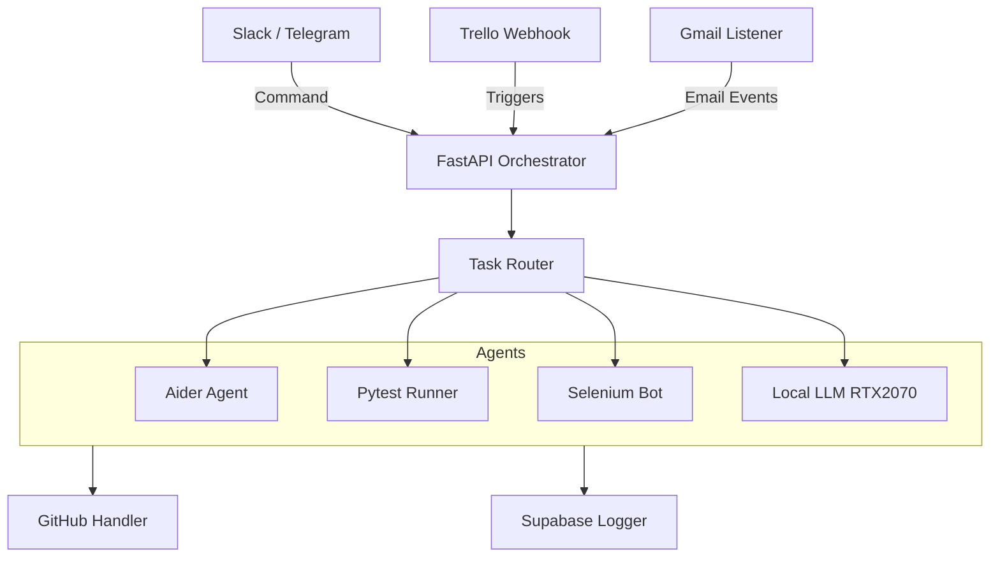
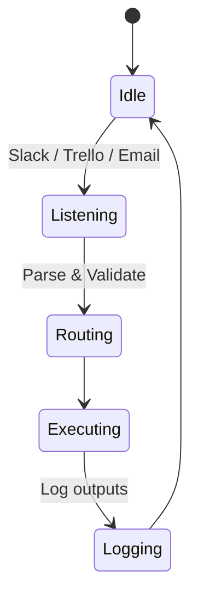
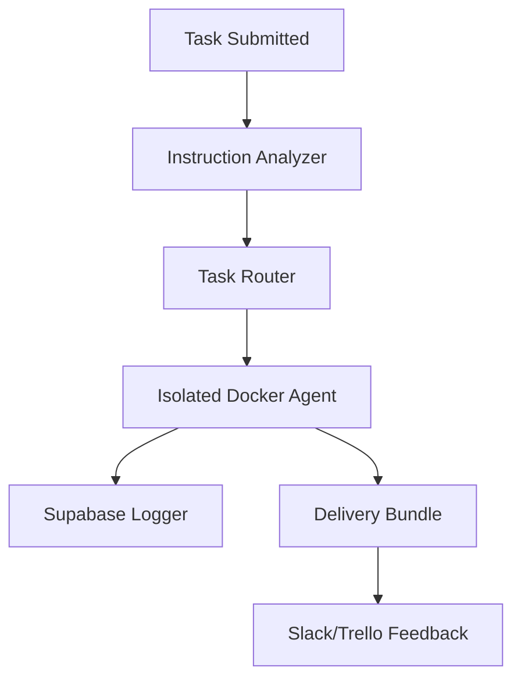
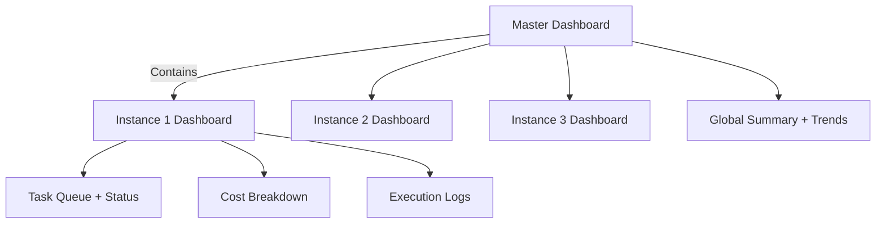

# Jace Berelen: AI-Driven Workflow Automation & Overemployment Engine

Jace Berelen is a generalist AI-powered orchestrator designed for full-lifecycle task automation across software development, analytics, QA, design, research, documentation, and operations. The project originated with the goal of enabling overemployment support for high-skill professionals while maintaining enterprise-grade security, low cost, and eventual productization.

---

## Vision

To build a secure, extensible, and intelligent platform that helps professionals automate parallel work streams, deliver high-quality results, and eventually scale into a commercial SaaS product. Jace should operate with:

- **Minimal AI costs** (local model preference)
- **Maximum observability** (task-level audit, dashboards)
- **Total compartmentalization** (scoped containers, AI task limitations)
- **Multimodal interfaces** (Slack, Telegram, Email, Trello, Dashboards)
- **Task diversity**: code, QA, research, writing, design, documentation

---

## System Architecture



---

## Primary Use Cases

- Managing 5–10 jobs simultaneously, each in separate environments
- Producing documentation, logos, testing reports, data pipelines
- Responding to Trello assignments, GitHub PRs, Slack tasks automatically
- Delivering full instructions for deployments in limited-access environments
- Serving as a private digital secretary (check emails, reminders, activity reports)
- Web scraping, data transformation, QA regression testing
- Acting as a productivity multiplier for developers, analysts, and consultants

---

## Maturity Stages

| Stage | Description | Timeline |
|-------|-------------|----------|
| **Stage 0** | Quick Proof-of-Concept with Slack bot, Aider, Trello | Today |
| **Stage 1** | Overemployment support (5 jobs) with delivery instructions | Month 1-2 |
| **Stage 2** | 10 concurrent projects with containerized execution & dashboards | Month 3-6 |
| **Stage 3** | Full SaaS platform with AI agents, billing, and multi-tenancy | Month 6-12 |

---

## Technology Stack

### Core System
- Python 3.11+
- FastAPI (task API, webhook listener)
- Celery (task queue, retries, chaining)
- Docker (containerized agent isolation)
- Supabase (PostgreSQL + pgvector)
- Railway (prototype hosting)
- Terraform + AWS CLI (prod IaC)

### AI Tooling
- Aider (OpenAI-powered dev agent)
- Continue.dev (IDE-injected workflows)
- Local LLMs: LLaMA, DeepSeek, Mixtral (via `llama.cpp`)
- GPT-4 / Claude / Gemini (fallback API models)

### Automation & Integration
- PyGitHub, GitPython (for PR/clone actions)
- python-slack-sdk & python-telegram-bot
- Selenium & Playwright (web automation)
- Trello SDK + Gmail API
- Pytest & Coverage.py for automated QA

### Dashboards
- Streamlit (3 instance dashboards + 1 master)
- Plotly + Supabase for real-time visual reporting

---

## Core Features

- **Slack + Telegram dual control interface**
- **Agent orchestration** via FastAPI + async runners
- **GitHub integration** for cloning, PR creation, and CodeRabbit reviews
- **Trello monitoring** for card assignments, labels, custom fields, and comments
- **AI runners**: Aider, Continue.dev, Claude, GPT-4, or local LLMs (DeepSeek, GGUF)
- **Secure, scoped container execution** (Docker) per task or job
- **External access** via Selenium for tasks like Shopify editing or dashboard validation
- **Delivery bundles**: Complete instructions even without system access
- **Supabase integration** for logging, task history, vector memory (pgvector), and user auth

---

## Security Design Principles

- AI models never access `.env`, secrets, or full repo unless required
- All AI tasks run in secure Docker containers with scoped volumes
- The orchestrator signs off on all deploy-level actions
- GitHub PRs require Slack approval before merging
- Production systems can run 100% airgapped (manual bundle delivery)
- AI agents have no access to secrets
- Secrets managed at orchestrator level via `.env` or AWS Secrets Manager
- Full traceability and human override for all sensitive tasks

---

## Cost Optimization Model

### Cost Calculation Formula

We define the estimated **monthly cost** as:

```
C = (U_api × R_api) + (U_llm × R_llm) + (H_gpu × R_gpu) + M_supabase
```

Where:
- U_api = number of external API calls (e.g., GPT-4)
- R_api = cost per API call
- U_llm = number of local LLM calls
- R_llm = cost per local execution (≈ energy use)
- H_gpu = GPU usage in hours
- R_gpu = hourly cost for local GPU (amortized)
- M_supabase = Supabase monthly subscription

**Example:**
```
C = (1500 × 0.003) + (3000 × 0.0005) + (120 × 0.02) + 25 = $33.40
```

### Cost Optimization Tactics

- Primary execution via local LLMs on RTX 2070 machines (32GB RAM)
- No AI model loads unless explicitly needed (triggered by tag or label)
- Python-native automation (e.g., Trello, GitHub) over language models
- Logging and vector storage is selective to reduce Supabase costs
- Slack message batching to reduce API overhead
- Token-based usage monitoring and AI quotas per task/client
- GPT-4 only used when strictly needed, otherwise fallback to Claude or local model

---

## Workflow Routing Logic



---

## Agent Execution Strategy



---

## Monitoring & Dashboards

### Streamlit Dashboard Layout



### Dashboard Features

- 3 dedicated dashboards per active Jace instance:
  - Task queue status
  - Agent status (idle, busy, failed)
  - Cost/time per job
  - Errors, retries, escalations

- 1 master dashboard:
  - Cross-instance aggregation
  - Total compute and model costs
  - Alerts + override panel
  - Client/workspace quota management

---

## Examples of Intelligent Tasks

- Auto-generating Streamlit dashboards based on `.csv` analysis
- Web scraping product data and auto-posting to Notion
- Auto-generating 90% accurate CI/CD YAMLs from Slack instructions
- Generating README.md, LICENSE, changelogs from project scans
- Summarizing GitHub PRs for product managers
- Extracting KPIs from analytics reports via OCR + PDF parsing

---

## Task Trigger Examples

- Trello card tagged `auto-design` → invokes `ui_drafter` agent
- GitHub PR created by client → summary + test results posted back
- Email with `subject: PROD DOWN` → escalation to Telegram + summary
- Slack command `/jace aider edit app.py` → starts background agent
- `/jace test https://github.com/user/repo` – clones, runs pytest, posts result
- `/jace scrape https://example.com` – uses Selenium, returns text or screenshot

---

## ChatGPT Integration (Interface Roles)

| Assistant | Role | Purpose |
|-----------|------|---------|
| **Log Analyst GPT** | Queries Supabase to summarize task failures, duration, agent behavior | "What happened to job `pytest_runner` yesterday?" |
| **Instruction GPT** | Accepts conversational commands, converts to JSON/API-compatible formats | "Generate the GitHub Actions YAML for this Node app" |
| **Executive GPT** | Suggests work order, resource usage, or how to reduce model usage | Budget-aware planning and team coordination |

---

## Output & Delivery Flow

When AI cannot access production systems:

- Jace packages code, assets, changelogs, and steps into a ZIP
- A Slack message or Trello comment delivers a "delivery bundle"
- You receive CLI-ready commands, instructions, test plans

This enables "airgap-safe" delivery for overemployment and sensitive clients.

---

## Fallback and Redundancy Strategy

- **Retry-on-failure pipelines**
- **Log all task requests, inputs, and outputs** in Supabase
- **Task replay enabled** from unique task ID
- **Telegram fallback interface** in case Slack is down
- **Model fallback** (Claude ↔ GPT ↔ Local LLM)
- **Nightly Supabase export** for full state backup

---

## Multi-Workspace Isolation

Each job/project is managed in isolation:

- Separate Trello board
- Separate vector store (or namespace)
- Separate agent config (model, memory, timeout)
- Each Slack channel is treated as a unique "workspace"

This enables 5–10 job handling without crossover or confusion.

---

## Roadmap by Stage

### Stage 0: Instant Test (Today)
- Slack bot with `/jace aider` and `/jace test` commands
- FastAPI server with webhook routes
- Trello + Aider + Pytest integration
- Basic command loop operational

**Minimal Setup:**
1. Install Aider locally + set OPENAI key in `.env`
2. Create Slack bot + webhook routes
3. Connect to Trello webhook + Supabase DB
4. Test basic `/jace` commands

### Stage 1: Overemployment (5 jobs)
- Gmail + Trello + Slack unification
- Scheduled summaries and status updates
- Markdown delivery bundles
- Per-project memory and isolation
- Slack daily digest with updates from Trello/GitHub per job

### Stage 2: 10 projects
- Containerized runner pools
- Cross-client Trello control
- Streamlit dashboards for ops
- Shopify/WordPress auto-editing
- All projects tracked in master dashboard

### Stage 3: SaaS Product
- Stripe metering + API key issuance
- Multi-user Slack app
- Onboarding wizard (connect Trello, GitHub, Gmail)
- Tiered plans, rate limiting
- Usage-based billing
- Workspace multi-tenancy and whitelabeling

---

## Strategic Monetization Features

- **Billing and quota system**
- **Contractor/VA copilot mode**
- **Client-specific GitHub + Trello linking**
- **Replay and audit of tasks**
- **Deploy via secure PRs, not direct shell**
- **Voice command support**
- **Embedded task guidance for low-access environments**

---

## Infrastructure Strategy

- **Prototype**: Railway + Supabase
- **Production**: AWS + Terraform + AWS CLI
- **CI/CD**: GitHub Actions + CodeRabbit

---

## Final Implementation Notes

Jace Berelen is a system designed not just to automate code, but to create **autonomous delivery pipelines** for any type of digital task — from design and dev to QA and documentation. With multi-instance support, cost-awareness, and compartmentalized intelligence, Jace can operate like a **small AI agency**, controlled through Slack and running from your local machine.

Key principles:
- Each AI task is scoped and logged for transparency
- All modules are modular, observable, restartable
- You can sell services on top of Jace while using it privately
- Full logs, retry, billing, Slack threads, and delivery packages available per task 